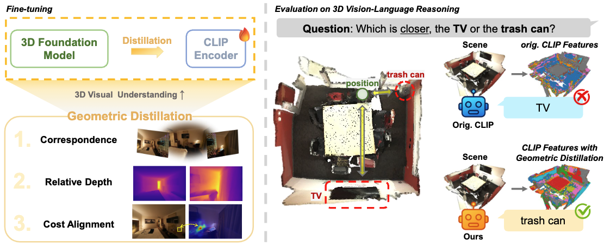
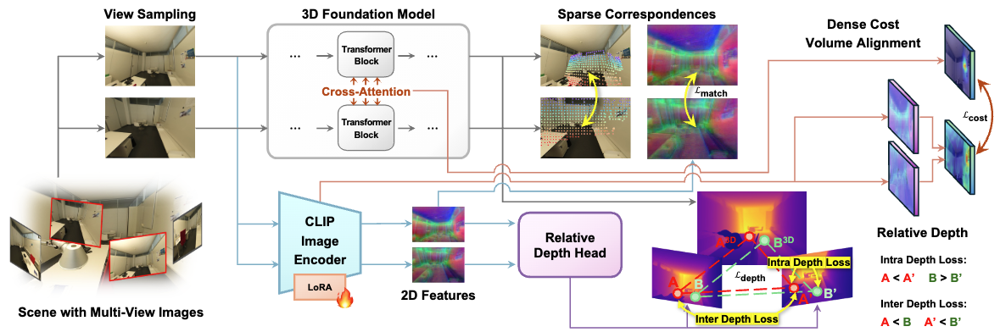

<h2 align="center">
    3D-Aware Vision-Language Models<br/>
    Fine-Tuning with Geometric Distillation
</h2>
<h5 align="center">
    Seonho Lee<sup>*</sup>, Jiho Choi<sup>*</sup>, Inha Kang, Jiwook Kim, Junsung Park, Hyunjung Shim<sup>†</sup><br>
    <br/>
    <p>
        *: equal contribution,  †: corresponding author
    </p>
    Graduate School of Artificial Intelligence, KAIST, Republic of Korea<br/>
    <br/>
    <code>{glanceyes, jihochoi, rkswlsj, tom919, jshackist, kateshim}@kaist.ac.kr</code><br/>
</h5>


<h4 align="center">

[](https://arxiv.org/abs/2506.09883)

</h4>


<div align="center">
    
</div>


</h4>

---


<br/>

## Geometric Distillation
We propose a lightweight, annotation-free fine-tuning framework that injects human-inspired geometric cues into pretrained VLMs without modifying their architecture. 

By distilling (1) sparse correspondences, (2) relative depth relations, and (3) dense cost volumes from off-the-shelf 3D foundation models (e.g., MASt3R, VGGT), our method shapes representations to be geometry-aware while remaining compatible with natural image–text inputs. 


<div align="center">
    
</div>

<br/>

## Updates

- [x] [2025.06.12] 📄 Our paper is now available! You can find the paper [here](https://arxiv.org/abs/2506.09883).


<br/>

## Installation

<!-- TODO: INSTALL.md -->

```sh
# ------------------
#     Init conda
# ------------------
conda create -n 3dvlm_gd python=3.10 -y
conda activate 3dvlm_gd
pip install torch==2.1.2+cu118 torchvision==0.16.2+cu118 --extra-index-url https://download.pytorch.org/whl/cu118
conda install -c "nvidia/label/cuda-11.8.0" cuda-toolkit


# --------------------------
#     Install Python packages
# --------------------------

pip install -r requirements.txt

# --------------------------
#     Install CroCo / DUSt3R / MASt3R
# --------------------------
# If error occurs, please refer to the each official repository.
pip install -r dust3r/requirements.txt
pip install -r dust3r/requirements_optional.txt
# DUST3R relies on RoPE positional embeddings for which you can compile some cuda kernels for faster runtime.
cd dust3r/croco/models/curope/
python setup.py build_ext --inplace
cd ../../../../

# --------------------------
#     Install VGGT
# --------------------------
pip install -r vggt/requirements.txt
```
<br/>


## Data Preparation

### Objaverse

The dataset can be downloaded from the [Objaverse](https://github.com/allenai/objaverse-xl). We use the 10k subset of Objaverse as in [Multiview-Equivariance Finetuning](https://github.com/qq456cvb/3DCorrEnhance). Please follow the instructions introduced in [this section](https://github.com/qq456cvb/3DCorrEnhance?tab=readme-ov-file#data-preparation). 

After setup, the resulting directory structure should look like the following:

```
data/
└── objaverse/
│   └── hf-objaverse-v1/
│       └── glbs/
│           ├── 000-000/
│           ├── ...
│           └── 000-159/
└── objaverse_renderings/
│   ├── 000-000/
│   ├── ...
│   └── 000-159/
└── 10k.txt
```

<br/>

### ScanNet++

We use ScanNet++ preprocessed by [FiT3D](https://github.com/ywyue/FiT3D) for both training and evaluation. To prepare the dataset, please follow the instructions provided in [this section](https://github.com/ywyue/FiT3D?tab=readme-ov-file#evaluation), or directly download the preprocessed data from [the link](https://drive.google.com/file/d/18BGnCzk51nv79M-SiJ6ezX2WOTcQDZyi/view?usp=sharing).

After downloading, place the data in the `data/scannetpp` directory. The resulting directory structure should look like the following:

```
data/
├── {other datasets}
└── scannetpp/
    ├── masks/
    ├── metadata/
    └── scenes/
        ├── 036bce3393
        ├── ...
        └── fe1733741f
```

<br/>

### PF-PASCAL

We use PF-PASCAL dataset for evaluation. Please follow the instruction in [this seciton](https://github.com/qq456cvb/3DCorrEnhance?tab=readme-ov-file#data-preparation). 

After setup, put the `data/test_pairs_pf_different_views.csv` and `data/test_pairs_pf_same_views.csv` files in the `data/PF-dataset-PASCAL` directory. The resulting directory structure should look like the following:

```
data/
└── PF-dataset-PASCAL/
    ├── Annotations/
    ├── JPEGImages/
    ├── test_pairs_pf_different_views.csv
    └── test_pairs_pf_same_views.csv
```

<br/>

### OnePose-LowTexture

We use OnePose-LowTexture dataset for evaluation. Please follow the instruction in [this seciton](https://github.com/qq456cvb/3DCorrEnhance?tab=readme-ov-file#data-preparation). 

To be in detail, please download the `LowTexture` dataset from [OnePose++](https://github.com/zju3dv/OnePose_Plus_Plus) and rename the directory to `data/onepose_lowtexture`.  Also, please reconstruct the object point cloud by the following command as in the repository:

```bash
python run.py +preprocess=sfm_inference_lowtexture.yaml use_local_ray=True # for lowtexture test data
```

You can get the `data/sfm_output`, and the resulting directory structure should look like the following:


```
data/
└── lowtexture_test_data/
│   ├── 0700-toyrobot-others
│   ├── ...
│   └── 0748-penboxvert-others
└── sfm_output/
    └── outputs_softmax_loftr_loftr
        ├── 0408-colorbox-box
        ├── ...
        ├── 0748-penboxvert-others
        └── vis3d
```

<br/>

### TAP-Vid DAVIS

We use TAP-Vid DAVIS dataset for evaluation. Please follow the instruction in [this seciton](https://github.com/qq456cvb/3DCorrEnhance?tab=readme-ov-file#data-preparation). 

To be in detail, please download the vidoe dataset from [this link](https://www.dropbox.com/scl/fo/7s2rgsm92qbzzh2xnx51d/AIvXxRaJPL2RQm43Zi_taJU?rlkey=6cs0bm2u0on1u7z0jyxlq8avq&dl=0) and rename the directory to `data/davis_480`.  Please check that the data file `tapvid_davis_data_strided.pkl` is in the `data` directory.:


```
data/
└── lowtexture_test_data/
│   ├── 0700-toyrobot-others
│   ├── ...
│   └── 0748-penboxvert-others
└── sfm_output/
    └── outputs_softmax_loftr_loftr
        ├── 0408-colorbox-box
        ├── ...
        ├── 0748-penboxvert-others
        └── vis3d
```


<br/>
<br/>

## Usage

### Run (Fine-tuning + Evaluation)

```bash
python3 src/main.py --config-name {config_name}

# Example
python3 src/main.py --config-name finetune_timm_mast3r_scannetpp
```

You can modify the configuration file in `config/` directory. The default configuration is `finetune_timm_mast3r_scannetpp.yaml`, which is used for finetuning on ScanNet++ dataset with MASt3R.


<br/>

### Evaluate (with Finetuned Model)


#### 3D Correspondence Understanding

```bash
python evaluate_timm_mast3r.py \
    --ckpt {checkpoint path} \
    --transfer
```

<br/>


#### Depth Estimation & Semantic Segmentation


Please follow the [FiT3D](https://github.com/ywyue/FiT3D) repository for evaluation.

<br/>

#### 3D VQA

Please follow the [Lexicon3D](https://github.com/YunzeMan/Lexicon3D) repository for evaluation.


<br/>


## Acknowledgements

We would like to express our gratitude to the open-source projects and their contributors, including [MEF](https://github.com/qq456cvb/3DCorrEnhance), [FiT3D](https://github.com/ywyue/FiT3D), and [Lexicon3D](https://github.com/YunzeMan/Lexicon3D).

